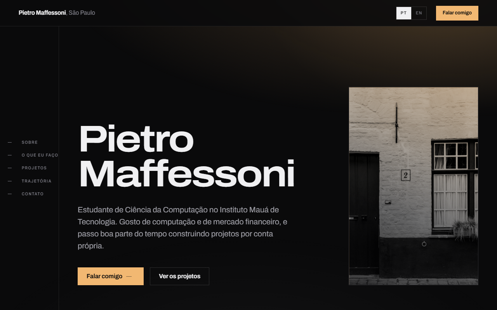

# Portfólio

Meu site pessoal, onde eu conto quem sou, o que já construí e como falar comigo.

**No ar em [pietromaffessoni.github.io](https://pietromaffessoni.github.io)**



## Sem framework, sem build

O site é HTML, CSS e JavaScript puro. Não tem React, não tem npm, não tem passo de build
e não tem uma única dependência. Você baixa a pasta, abre o `index.html` e vê o site
inteiro funcionando, inclusive sem internet.

Fiz assim de propósito. Uma página não precisa de framework, sem dependência não tem o
que quebrar daqui a dois anos, e dá para ler o projeto inteiro de cima a baixo sem
conhecer ferramenta nenhuma.

## Rodar

```
git clone https://github.com/PietroMaffessoni/pietromaffessoni.github.io.git
```

Abre o `index.html` no navegador. É só isso.

Se preferir servir por HTTP:

```
python -m http.server 5173
```

e abre `http://localhost:5173`.

## O que tem dentro

```
index.html   a página inteira, nos dois idiomas
styles.css   todo o visual, com as variáveis de cor e espaçamento no topo
main.js      idioma, animação de entrada, seção atual, menu e copiar e-mail
fonts/       Archivo e Azeret Mono, servidas daqui, nenhuma chamada externa
img/         as fotos e os ícones das tecnologias
```

## Português e inglês

O português está escrito no HTML e o inglês fica no atributo `data-en` do mesmo elemento:

```html
<h2 data-en="Some projects">Alguns projetos</h2>
```

Para imagem é `data-en-alt` e para rótulo de acessibilidade é `data-en-aria`. Texto novo
precisa dos dois. Sem JavaScript a página abre em português, e a escolha de quem visita
fica salva no `localStorage`.

## Decisões que valem saber

- **Nenhum listener de `scroll`.** A seção atual no trilho lateral vem de
  `IntersectionObserver` e a barra de progresso vem de uma scroll timeline em CSS. Rolar
  a página não dispara JavaScript nenhum.
- **Todo o movimento respeita `prefers-reduced-motion`.** Quem tem animação desligada no
  sistema recebe a página parada, inteira e legível.
- **Zero requisição externa.** As fontes, as fotos e os ícones estão todos no
  repositório. O site não chama CDN, não chama Google Fonts e não carrega nada de
  terceiros, então também funciona offline.
- **O e-mail dá para copiar.** `mailto:` só abre alguma coisa em quem tem aplicativo de
  e-mail configurado, e muita gente não tem. O botão tenta a API de clipboard, cai para
  `execCommand` e, se nada funcionar, deixa o e-mail selecionado na tela.
- **Recarregar volta para o topo.** O navegador restaura a rolagem por padrão, o que
  fazia um F5 reabrir no meio da página. Um link com `#secao` continua caindo na seção
  certa.
- **O ano do rodapé se escreve sozinho**, para o site não envelhecer parado.
- **Uma cor de destaque só**, o âmbar da luminária, e canto reto em tudo.

## Os projetos que aparecem no site

- **[Zelo](https://github.com/PietroMaffessoni/Zelo)** — aplicativo para condomínios, em
  Expo, TypeScript e Supabase.
- **[Nimbus Personal](https://github.com/PietroMaffessoni/Nimbus-Personal)** e
  **[Nimbus Business](https://github.com/PietroMaffessoni/Nimbus-Business)** — finanças
  pessoais no celular e gestão para pequenas empresas na web.
- **[VagaLume](https://github.com/PietroMaffessoni/Projeto-Integrador)** — vagas de
  estacionamento em tempo real, com uma maquete 1:64 e um sensor em cada vaga.

## Falar comigo

- E-mail: pietromaffepena@gmail.com
- LinkedIn: [/in/pietro-maffessoni](https://www.linkedin.com/in/pietro-maffessoni/)
- GitHub: [@PietroMaffessoni](https://github.com/PietroMaffessoni)

---

**In English:** my personal site, built with plain HTML, CSS and JavaScript. No
framework, no build step, no dependencies — clone it, open `index.html` and the whole
thing runs, offline included. The page ships in Portuguese and switches to English
through `data-en` attributes. Live at
[pietromaffessoni.github.io](https://pietromaffessoni.github.io).
